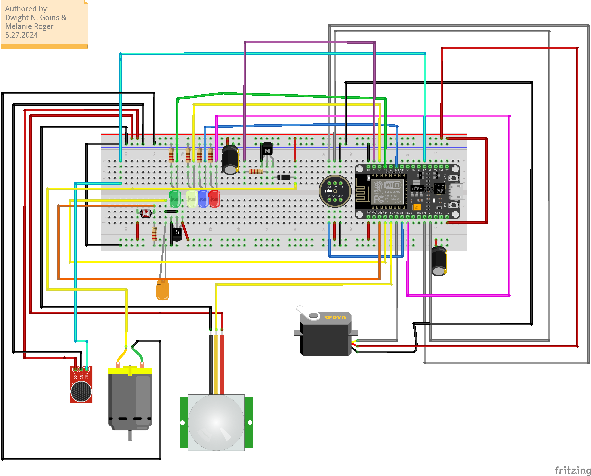

# Known Neb Circuits
[Supporting Video](https://youtu.be/zoNuiFG_GVk)

## Introduction

Imagine a home that listens, understands, and responds to your every command. Our Arduino-based smart home project, powered by the ESP microcontroller, transforms this vision into reality. This innovative system seamlessly integrates advanced technology into your everyday life, offering unparalleled convenience and control. By leveraging the power of sensors, microcontrollers, and cloud services, we have created a sophisticated home automation system that showcases the potential of modern technology

## Theory of Operation

The system consists of various sensors and devices, including light sensors, monitors, lights, a servo motor, and infrared sensors. Two microphones play pivotal roles—one for detecting loud sounds to trigger alarms, and another for recognizing voice commands. The system initializes by setting up all components and establishing a Wi-Fi connection to an Azure web server. In its idle state, it waits for input, ready to spring into action. Sound detections trigger alarms, while voice commands are processed and sent to Azure for interpretation. The processed commands then control devices such as lights, thermostats, and entertainment systems, enabling hands-free home automation.

## Objectives

1) Enhance Home Automation: Create a system that allows for hands-free control of various home devices.
2) Utilize Voice Commands: Implement voice recognition to enable intuitive interaction with the home environment.
3) Integrate Cloud Services: Use Azure cloud services for processing voice commands and managing device control.
4) Demonstrate Technological Synergy: Showcase the integration of Arduino, ESP microcontroller, and cloud-based technologies 

## Design Issues

During development, several challenges emerged. Integrating multiple sensors and devices required meticulous coordination and debugging. Managing memory limitations on the Arduino and ensuring reliable Wi-Fi connectivity were critical hurdles. Additionally, refining the voice recognition system to accurately interpret commands was a complex task, demanding precise calibration and testing.

## Lessons Learned

This project offered invaluable insights into the integration of hardware and software for home automation. We learned the importance of efficient memory management on microcontrollers and the intricacies of establishing reliable network connections. Furthermore, we gained hands-on experience with cloud-based services and their potential to enhance local systems. Troubleshooting and iterative testing underscored the importance of patience and persistence in achieving a seamless operation. Also, having multiple copies of components comes in handy. It is inevitable that one component could be wired up incorrectly burning out the component. Having multiple copies of the component allows for quick replacement and continued testing. Also the ESP32 reuses some of its pins for internal functionality, such as the Wifi used pins for the Tx and Rcv functionality and we had to move our connections around because of this. Lastly, having a good understanding of the components being used is crucial. This allows for quick troubleshooting and debugging of the system. 

## Future Enhancements

The potential for future enhancements is vast. Integrating additional smart devices, such as security cameras and advanced environmental sensors, could further enhance functionality. Improving voice recognition accuracy and expanding the command set would make the system even more intuitive. Additionally, developing a mobile app for remote control and monitoring could provide users with greater flexibility and convenience.

## Conclusion

Our smart home system demonstrates the transformative power of technology in enhancing daily life. By combining the Arduino microcontroller, ESP Wi-Fi capabilities, and Azure cloud services, we have created a responsive and intelligent home environment. This project not only showcases the potential of home automation but also inspires further innovation and development in the field. Step into the future with a home that truly understands and responds to your needs, making everyday tasks effortless and enjoyable.